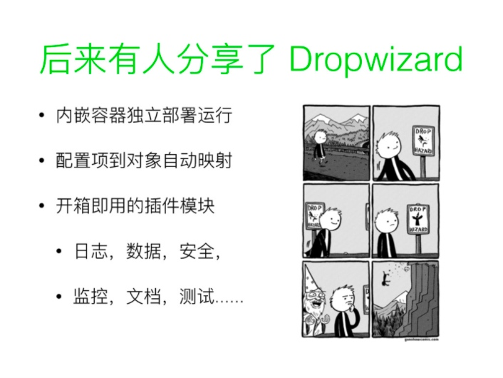

---
layout:	post
date: 	2017-08-23 19:30:00 +0800
title: '回顾我的微服务之旅'
tags:	[microservice, springboot, dropwizard]
---

# 引言

2015年的元旦，我加入了[挖财](http://www.wacai.com/)，而后的两年时间里我所经历的，在今天看来是非常值得记录的。

整个过程看起来有点像是一场**没有计划**的探险，大多都是自己和伙伴们见招拆招凭着经验和直觉一路走下来的。

现在，我把它称之为是“微服务之旅”，并这里细数道来，为的是让它作为[Microservices][ms]一文的补充案例，供同道者借鉴与反思。

<!--more-->

# [Dropwizard](http://www.dropwizard.io/1.1.4/docs/)，契机

> 坦率的讲， 2015年**微服务**已经是架构圈里的热门话题，然而我还停留在对 [**SOA**](https://martinfowler.com/bliki/ServiceOrientedAmbiguity.html) 似懂非懂的阶段。过往的经验告诉我，时髦的词汇是用来装逼的，而眼下有实实在在的问题等着我去解决。

入职数月后，几次线上故障的处理驱使我开始认真审视现有的系统架构。它是一个非常主流的 Java 单体应用（Monolithic Application）`Spring + Mybatis`，满足当时的业务场景已经绰绰有余，只是一些工程实施上的细节为故障埋下了隐患：

* 各种混杂的配置文件（Bean 描述，SQL模版，Properties），稍不留神就拼写错误，尤其是线上环境粗暴更新
* 没功夫预留监控指标埋点，也就没有任何可以一目了然地反应系统运行状态的途径
* 基于WAR的Web容器化部署， 新增一个应用实例， 人肉操作半天

以上对于一个职业素养不错的团队而言可能不是个事，然而一个优秀的开发框架却可以拔高一个年轻团队的基础能力。

> 2012年我就曾用 Dropwizard 独立开发了内部中间件的运维支持应用，总体感觉就是“快，多，好，省”。

随即，我面向团队以及全公司分享推广 Dropwizard， 也率先在信贷业务线的非核心系统上作试点。


（图片源自[spring-boot 在统一架构体系中的价值](https://speakerdeck.com/zhongl/spring-boot-zai-tong-jia-gou-ti-xi-zhong-de-jie-zhi)）

正在公司推行实施服务化的王福强（[扶墙老师](https://afoo.me/)）受此举启发，也为日后选用 [SpringBoot](http://projects.spring.io/spring-boot/) 构建微服务体系打响了第一枪。

> 为什么选择 SpringBoot 而不是 Dropwizard ？扶墙老师在 [Spring Boot Rock'n'Roll](https://afoo.me/posts/2015-07-09-how-spring-boot-works.html) 一文中做了说明。

# 服务化拆分

> 扶墙老师，[宏江](http://hongjiang.info/)和我在阿里都曾经历过服务化，深知系统架构服务化在互联网公司高速发展中的积极作用。
 
2015年P2P市场火爆，随之而来竞争也是激烈的，信贷业务线尤为如此。为了抓住流量，业务上不断拓展各种贷种模式，去尽可能多的覆盖不同消费群体。此时，对于技术团队的要求就是竭尽全力快速迭代开发，以支撑业务快速试错。

面临这样的局面，单体应用的架构风格显然已经无法应对：

* 同一代码库的分支合并时常陷入冲突的泥沼，多人协作开发效率遇到瓶颈，反而人越多效率越低；
* 贷种繁多且存在业务规则冲突，代码各种`if-else`的临时方案，导致测试排错极为耗时；
* 应用升级必重启，为减少系统不可用时间对业务的影响，不得不选择凌晨发布，梦魇不断。

拆，必须拆，越早拆越好！

## 前后端分离

传统的 Java Web 开发，页面以静态渲染为主，少量的 JavaScript 做表单动态交互。然而在移动互联网成为主流后，更为苛刻的 Web 用户体验要求交互尽可能多的在设备上完成，迫使应用服务必须提供 Web API 给前端应用逻辑使用。

> 2014年下半年，挖财理财业务线就已经引入 [Dubbo](http://dubbo.io/) 进行服务化改造了。考虑到前后端分离的大势下， Web API 是不可或缺的。为此，服务化用 Dubbo 是否是最合适的， 我们内部产生过激烈的争辩。

## 抽离核心服务

即便是单体应用，其实也是可以做到多贷种并行开发的， 无非是一个贷种一个单体应用而已。可是，其中公共的逻辑，如订单，资料，合同，绑卡，支付，反欺诈等，莫不是要重复开发？ 抛开实现优雅与否不谈，单从研发效率上也是不能接受的。

自然地，这些公共的逻辑，应该转变为可复用的核心服务，供各类贷种业务服务编排使用。

## 分库分表

> 这里的分分库分表**并非**指，为了提升数据访问并行度，而基于某个字段值的水平分块

可惜，服务的抽离拆分并没有想象中那么简单。之前单体应用风格下，数据库里的一张订单的大宽表（超过50个字段），将所有核心逻辑耦合在一起了， 即它们逻辑的实现都需要操作同一张表，庞大的 DAO 让所有逻辑没有明确的边界。甚至，独立的信贷中后台系统（另一个单体应用），也会直接访问这张表， 这意味着业务逻辑变更一旦涉及到这张表，两大系统都要随着变。即便核心服务能够拆分，日后灾情只会更加严重。

```
+---------+                   +----------+
| 贷前系统 | ---> [订单表] <--- | 中后台系统 |
+---------+                   +----------+
```

> 类似这样的数据单点依赖，多伴随严重的性能问题或隐患。例如，中后台系统会有批量扫表定时任务，或是数据分析报表， 这对于要求实时响应较高的前台系统而言是致命打击。

因此， 服务分，数据也得分。库表的数据应根据服务逻辑抽象重新梳理建模，新建与对应服务高内聚的库表， 跨服务的数据访问，禁止直连数据库， 而是通过服务接口完成，确保服务之间不会因为数据结构的内部细节产生隐藏的耦合关联。

# 自治与协作

服务拆分伊始，每个核心服务抽离实现都会分派一位核心研发负责完成， 但这并不意味着，服务一旦上线，他的研发任务就结束了。日常运维，日后变更，**原则上**都是由他来负责到底。

你可能注意到我用了“原则上”三个字来限定。是的，现实中团队的人员总是紧张且频繁流动的，让某一两个人对一个服务或多个服务负责到底，有点强人所难， 而且容易形成协作瓶颈。

为此， 我在团队中推行 Github 的 PR（Pull Request）协作模式。假设，新的**贷种A服务**希望**核心服务B**提供新的接口支持，而**核心服务B**的负责人手头上有优先级更高的年终大促项目，此时**贷种A服务**的研发，应通过熟悉**核心服务B**的代码，从而提供新接口实现作为 PR 请求**核心服务B**负责人进行代码审查合并， 从而缓解或避免阻塞的状况。 久而久之，提供 PR 越多的研发，也慢慢的具备了接手**核心服务B** 的能力。

> 实际中操作的细节，可参见：

> * [一个简单易行的Gitlab项目分支管理办法](https://zhongl.github.io/2016/06/03/a-simple-strategy-of-branch-management/)
> * [如何用 Gitlab 做 Code Review](https://zhongl.github.io/2016/05/17/how-to-review-code-by-using-gitlab/)

为了能够让协作者参与的更顺利，核心服务的负责人有义务提供必需的README文档，帮助协作者快速熟悉项目代码， 比如：

1. 如何快速运行并调试代码
2. 核心逻辑设计思路
3. 测试用例指引

此外， 为了确保在服务故障时，相应负责人不能及时诊断处理， 负责人还需提供 OPS 操作要点文档，方便指导他人临时代为处理，其中包括但不限于：

1. 关键配置说明
2. 启动停止办法
3. 常见故障处理

# 研发支撑

要享受服务化带来的红利，以上部分只是冰山一角，更多在基础平台上的建设也是不容忽视的。这部分的内容，扶墙老师专门写了一本名为[《SpringBoot揭秘：快速构建微服务体系》](https://www.amazon.cn/dp/B01FSA1140)， 这里我就不在赘述了， 推荐阅读。

> 书中并未就时下最热门的 Docker容器化技术如何在微服务架构应用展开讨论，只是因为扶墙老师离开挖财的时候，挖财还未正式启用 Docker。但在2016年底，Docker 与 Kubernetes 已经在挖财开展实施了，代号 **K2**。

# 结语

追溯历史，业界大神们最早只是在研讨会上用“微服务”来统称一类新探索出来软件架构模式。此后一发不可收拾被受追捧，以至于误导了部分人盲从概念，形而上学。

反观以上内容，若是对照“微服务”的[共性特点](https://martinfowler.com/microservices/#what)来看，你会发现它们之间有惊人的相似度。

“微服务”的理念是值得提倡的，但更重要是理念背后形成的因果关系，愿每位踏上微服务之路的实践者都能摸索到适合自己当下环境微服务架构。

[ms]: https://martinfowler.com/articles/microservices.html

